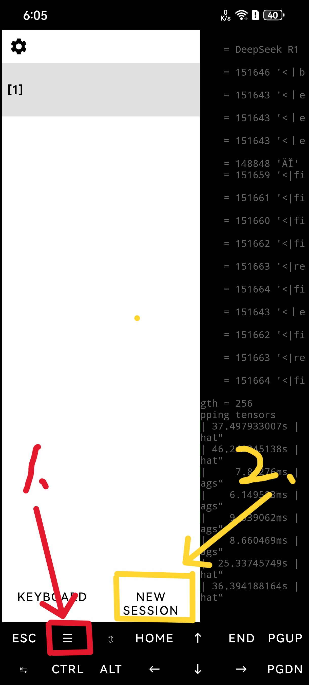
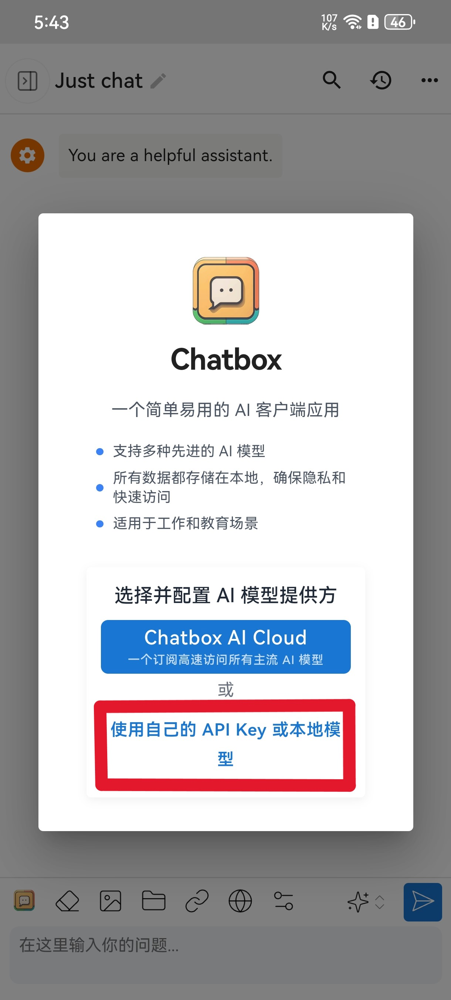
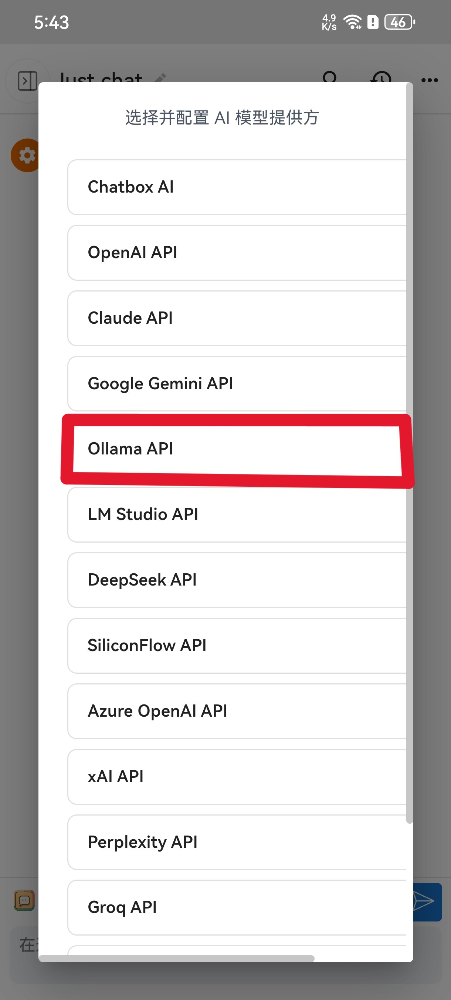
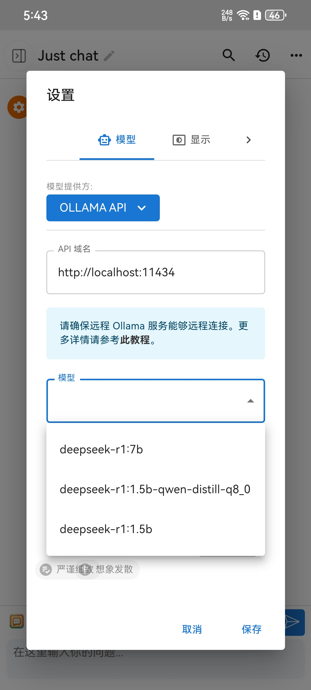
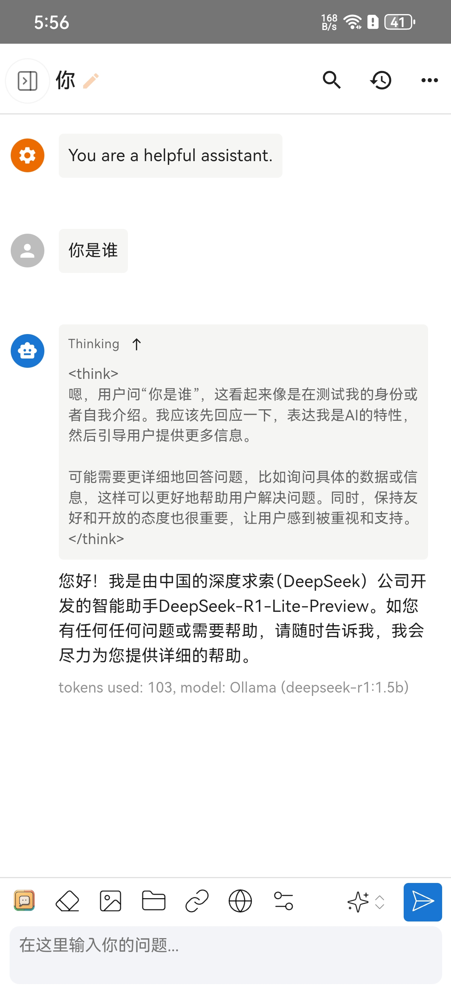

<div align="center">

<h1>DeepSeek-r1 for Andriod</h1>


</div>

> **相关项目**：
>
> - [SwanLab](https://github.com/SwanHubX/SwanLab)：训练、微调和量化模型的全程分析和监控工具，以及与实验室同学协作交流，大幅提升开发效率。


<br>

# 目录

- [项目简介](#-项目简介)
- [准备工作](#-准备工作)
- [Demo启动](#-运行-gradio-demo)
- [Python推理](#-python-推理)
- [联系我们](#-联系我们)
- [FAQ](#faq)
- [感谢支持](#-感谢支持)
- [License](#-lincese)
- [引用](#-引用)

<br>


# 项目简介

> 🚀 谢谢你对我们的工作感兴趣。您可能还想查看我们在人工智能领域的其他成果，欢迎来信:1617808562@qq.com.

**DeepSeek-R1** 是一款“推理模型”，旨在超越基本的模式识别，擅长逻辑推理、问题解决和理解复杂关系。 与传统的LLM（大语言模型）不同，DeepSeek-R1通过模拟逐步的思维过程来解决问题。 它将复杂问题分解为更小的逻辑步骤，然后得出解决方案。 这种方法虽然在推理时可能稍慢，但在需要深度理解的任务（如数学推理、编程辅助和决策制定）中表现显著更好。


**DeepSeek-r1 for Andriod 可以做到：**

在手机上部署 DeepSeek-R1，让你无需网络连接也能随时随地在手机中使用DeepSeek大语言模型。

项目将借助**Termux**和**Ollama**框架，Termux是一款可以再安卓手机中使用的终端软件，Ollama 是一个开源的大型语言模型（LLM）平台，旨在让用户能够轻松地在本地运行、管理和与大型语言模型进行交互。


---

如果 DeepSeek-r1 for Andriod 对你有帮助，请 star 这个 repo 或推荐给你的朋友，让大家都能随时用上deepseek！


# 🔧 准备工作

软件安装：
- 安装Termux：
从 [F-Droid](https://f-droid.org/packages/com.termux/) 下载最新版Termux（或者Google Play Store版本）
也可以从[Github下载](https://github.com/termux/termux-app/releases)
- 安装chatbox：chatbox[下载地址](https://chatboxai.app/zh/install?download=android_apk)

## 1. 配置Termux

```bash
termux-setup-storage #获取存储权限
pkg update -y && pkg upgrade -y #更新
pkg install git cmake golang proot-distro #安装用到的软件依赖
```

## 2. 安装Debian系统
>也可以安装ubuntu系统，debian系统占用的运行资源更少。

```bash
proot-distro install debian #安装Debian
proot-distro login debian #登陆Debian系统
apt update && apt upgrade -y
```

## 3. 安装Ollama（ARM64兼容版）
```bash
curl -fsSL https://ollama.com/install.sh | sh
```


# 🚀 Termux终端推理


## 1. 启动Olamma服务
```bash
ollama serve
# 保持此终端运行
```

## 2. 安装模型
不要关闭刚才的终端页面，打开一个新的终端



执行下面的命令：


```bash
proot-distro login debian #登录安装的Debian系统
ollama run deepseek-r1:1.5b #拉取模型
```
权重下载完毕就可以在命令行页面进行对话了。

<video width="640" height="360" controls>
  <source src="image/6.mp4" type="video/mp4">
  您的浏览器不支持HTML5视频播放器。
</video>


# ⚡️ 部署 API 服务

## 开启API
在终端中执行一下代码
```bash
OLLAMA_HOST=0.0.0.0
OLLAMA_ORIGINS=*
ollama serve
```

## 打开chatbox配置API
打开软件按以下步骤配置即可：

- 打开软件选择使用自己的API Key



- 选择Ollama API



- 配置api域名，选择要使用的模型



- 最后就可以聊天了
```
注意由于手机会限制后台应用的运行速度，且容易杀后台，使用时建议把termux的后台进程锁定。
```


<br>


# 📧 联系我们

如果您有任何问题，请发邮件至 1617808562@qq.com


